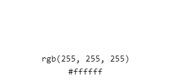

<!--title-->
# Spider-Man Super Quiz!- Project Portfolio 2- HTML, CSS and JavaScript.
<!--summary paragraph-->
The Spider-Man Super Quiz is a fun and interactive quiz which has been independently built by myself. The aim of the quiz is for Marvel fans, in particular fans of Spider-Man, to test their knowledge on their favourite superhero- Spider-Man. The fun but professional and inviting structure of the quiz means it is perfect for Spider-Man fans of all ages and knowledge to get started on seeing how well their Spider-an knowledge really is.

<!--link to live site-->
You can view the live site here.- *link*

<!--images of responsivity of quiz-->

<!--contents section-->
# Contents

* [**Project Aim**](<#project-aim>)
* [**User-Experience**](<#user-experience>)
* [Design Wireframes](<#design-wireframes>)
* [Webpage Structure](<#webpage-structure>)
* [Reasons for Design](<#reasons-for-design>)
* [Fonts](<#fonts>)
* [Colour Scheme](<#colour-scheme>)
* [**Features**](<#features>)
* [Quiz Page](<#quiz-page>)
* [Help Page](<#help-page>)
* [Final Page](<#final-page>)
* [Contact Page](<#contact-page>)
* [Footer](<#footer>)
* [**Future Features**](<#future-features>)
* [Rounds](<#rounds>)
* [Dark and Light Mode](<#dark-and-light-mode>)
* [**Technologies Used**](<#technologies-used>)
* [**Testing**](<#testing>)
* [**Bugs and Fixes**](<#bugs-and-fixes>)
* [**Deployment**](<#deployment>)
* [**Credits**](<#credits>)
* [Media](<#media>)
* [Content](<#content>)
* [**Acknowledgements**](<#acknowledgements>)

<!--project aim-->
## Project Aim
The main aim of my second project is to provide Spider-Man fans with a fun and interactive quiz that they can access whenever they want to test their Spider-Man knowledge. The quiz was made to be a quick and fun escape from the real world, into the Marvel universe for fans who need mind stimulating fun. I aim to use HTML and CSS to structure and style the quiz in a fun and inviting but still professional way whilst using JavaScript to add fun and interactivity to the quiz. 

[Back to Contents](<#contents>)
<!--user experience-->
## User Experience

### Design Wireframes
For my second project I decided to carry out the initial designs on Figma, creating wireframes for desktop and mobile sized screens. The initial wireframes were created to help visualise the structure of the quiz however the ultimate structure and colour scheme of the quiz ended up being different to increase the accessibility and interactivity of the quiz. In the final design I decided to add the score board as a pop up screen and insert contact and help pages. This was to increase interactivity. The final layout of the quiz also has a sleeker and more professional feel and finish.

<!--webpage structure-->
### Webpage Structure
The Spider-Man Super Quiz takes on an easy to navigate structure. The quiz has been made to be accessible to users of all ages and therefore I decided to make the quiz page the default page to avoid over complicating and confusing the user. The quiz container contains the Main Title, stating that the quiz that is being played- the Spider-Man Super Quiz. Directly under, the user can see the Game Details which shows the player their score and what question they are on. Directly under follows the question and a choice of four answers, once the user has selected their answer they can click the next question button as continue. Once completing the quiz, a pop up appears on the users screen displaying their score details. Outside the game container, above the container three buttons can be found, a Contact button leading to a contact form page, an Audio button to control sound, and a help button leading to an instruction page. One each page that is not the default quiz page a button with a home icon can also be found to take the user back to the quiz. The bottom of the page contains a simplistic footer with a reference to the webpage creator.

<!--reasons for design-->
## Reasons for Design

### Fonts
- To embody a comic feel to the quiz, for the main title of the quiz I decided to use Jolly Lodger for the font with sans-serif as the font that the browser can fall back on to if the browser used cannot support Jolly Lodger. The unique font is similar to the font used on the Amazing Spider-Man Comic covers therefore I knew it would be perfect for the title, Spider-Man fans will instantly recognise the style of font creating a positive feeling instantly. 
- Across the pages of the quiz, I decided to use Paytone One, once again with sans-serif as a font for the browser to fall back on if Paytone One is not available to the browser. I decided to use this font to create a contrast with the title font but also to add a professional look to the quiz. More so, using the Paytone One font mainly was a choice I made as the clean font is easier to read than if Jolly Lodger was used across the webpage, making the quiz more accessible, professional and clean.

### Colour Scheme
- For the quiz the colour scheme completely aligns with the colour scheme of the Spider-Man movies and comics. The quiz mainly occupies the iconic blue black and red colour trio that Marvel uses for Peter Parkers’ suit. These familiar colours create a positive and welcoming feel making users want to remain on the page and participate in the quiz. 
- The quiz title and text are white, this adds a fresh feel to the page and makes the text easy to read against the dark backgrounds that are red and blue/navy.  
- I decided to go for a darker blue for the background colours to make the quiz appear more professional. Spider-Man is an interest for individuals of all ages, my desire was not to make the quiz appear ‘childish’, the Spider-Man universe based in Queens portrayed in the movies has always had a dark undertone to it through the dark rainy scenes and characters such as Venom, I used the darker colour scheme to portray this darker theme and why I believe Spider-Man caters to older audiences as well as younger audiences. This also helped increase inclusivity of the quiz. 

[Back to Contents](<#contents>)

<!--features-->
## Features
The Spider-Man Super Quiz is designed to be fun, interactive, inclusive and easy to navigate with a maintained structure and colour scheme the quiz achieves an inviting and comforting feel. The features of the quiz are used to promote the users want to complete the quiz and promotes feelings of accomplishment once this has been done. The familiar colour scheme and sound effects support these feelings to the user. 

## Quiz Page

- When entering the quiz, this is the default page users are met with. The main quiz page maintains a simplsitic but classic Spider-Man feel with the iconic red, blue and white colours present on Spider-Mans' suit. 
- The user is displayed the game quiz container which contains the title at the very top with a spider icon the changes from navy to black when hovered over, for aesthetic reasons. Directly underneath is the game details which shows the user they are currently on a score of 0 and on question 0, as the user progresses through the quiz they will see the question number increase so they are able to track their progress through the quiz and will also hopefully see their score going up as they get an answer right- but maintain the same if the wrong answer is selected.
- Under the game details the user can see the question displayed on a blue background iconic to Peter, the white against the blue, which is against the read provokes a happy and nostalgic feeling as these are the classic colours of Peters suit, therefore I decided to follow the same theme for the four possible answer options displayed below the question. The user will have a question presented and one of the four answers are correct- the user will have to decide which that is and select that answer.
- Once selected, the correct answer will turn green and if it wasn't selected the incorrect answer that was selected will turn red (explained in further detail below). Next, the right facing arrow that the bottom of the game quiz container will take the user to the next question.
- Above the container, three buttons can be found, on the far left a button with a question mark which takes the user to a help/ instruction page, on the right the user can find a button with a letter icon that will lead the user to a sign up contact page and the last button will play a marvellous and euphoric superhero themed background audio when selected. I chose to give the three buttons the same gradient background colour as the quiz container for consistency.
- In the background, you can see Spider-Man peaking under the quiz container, in smaller images he becomes more visible however, the simplistic image was very intentional to ensure it wasn't distracting. More so, as the actual quiz content contained three already vibrant main colours, red, blue and white, I preferred a muted and professional background image.

- As seen above, when the user selects an answer and it is the correct answer, when the user clicks on the next button the answer selected will turn green and the user will be met with a chime sound to also indicate a correct answer, not only was this done for accessibility reasons but also to provoke a positive and accomplished feeling within the user. The score will also update to be +1 (as seen below), as will the question number update unless the user has reached th end of the quiz.

- As seen above, when the user selects an answer and it is the wrong answer, when the user clicks on the next button the answer selected will turn red and the correct answer will be revealed by turning green. The user will be met with a incorrect laser sound to also indicate that they have selected the incorrect answer, not only was this done for accessibility reasons but also to provoke a slightly disappointed feeling within the user so they are more motivated to try again and do better. The score will not update in this question as they have not earned a point but the question number will update unless the user has reached th end of the quiz.

- As seen above, if the user attempts to select the next question button without selecting an answer this prompt will appear to alert the user that this must be done to continue.
- This is also beneficial for when users accidently select the next button unintentionally, it will not force them to skip the question but they can merely close the pop up and continue with the quiz.
- When the Back to Quiz button at the bottom of the pop up is selected the user will be taken back to the question they were on.

## Help Page

- The help page starts will a title welcoming the user to the quiz, the page contains a simple, direct and comprehendable overview of the game that is accessible to a wide reading age range and english abililty range.
- For the overview text I decided to stick with the white colour font so it is as easy to read as possible, I used the same spider icon that is used in the main title of the quiz page as bullet points not only for aesthetics but also consistency. The icons and title of the help page both share the same navy colour also for consistency and relation to the Spider-Man theme.
- Just above the game container the user can find three buttons, one containing a home icon that will take the user back to the quiz, a button with a letter icon that will lead the user to a sign up contact page and the last button will play a marvellous and euphoric superhero themed background audio when selected.

## Final Page

- Seen above is the pop up the user will see once the quiz has been completed, this pop up contains an inviting messaging and directly under shows the user their attempts, number of wrong or right answers and their grade as a percentage out of 100%.
- Depending of the amount of correct answers, the text underneath will change, with a motivating piece of text in red for users who have achieved a score of 3 or under along with some sad audio playing in the background. If the user manages to achieve between 4 and 7 they will be met with a congratulating message in amber and an audio of cheers. Lastly, if the user achieves a score of above seven they are met with a praiseful message in green with a cheerful audio in the background too. This customisation was added so if the user did not do as well they are motivated to try again for a better score, or if they did do well they want to relive that euphoric feeling. More so, it is also to provide feedback to the user about their knowledge on Spider-Man and conclude the quiz.

## Contact Page

- The page seen above is a simple contact page for the user to complete that will sign them up for emails regarding the latest Spider-Man news.
- The sign up form is very minimalistic and quick to complete as I understand that the main reason users have come on to the page is to play the quiz therefore making the sign up form short and easy to complete heightens the chance of users completing the form. Furthermore, simplicity enhances accesibility and for a quiz the caters to such a wide range of people from ages, to background etc. it is important that the contact page is not overcomplicated.
- At the bottom of the sign up form the user can select the three icons present, the github, twitter and instagram icons each open up on a new tab and are black to match the input field text/placeholder text and text on the submit button.

## Footer.

- The footer states the creater of the webpage and copyright information.
- The footer is thin in height to not act as a distraction and is not overloaded with information for simplicity and a sleek professional finish.

[Back to Contents](<#contents>)
<!--future features-->
## Future Features 
<!--rounds-->
### Rounds
- Different rounds of difficulty for the quiz which will allow users to progress to more difficult rounds as they answer the questions will be introduced to promote interactivity. 
- The rounds will include a mixture of worded answers, picture answers and multiple-choice answers. 
<!--light and dark mode-->
### Dark and Light Mode
- The ability for the user to choose whether they would prefer a lighter, fresher theme or a darker more comforting theme will be introduced with a light and dark mode button. This would push users to play the quiz at different times or the day and improve both accessibility, aesthetics and adaptability. 

[Back to Contents](<#contents>)
<!--technologies used-->
## Technologies Used
[HTML5](https://en.wikipedia.org/wiki/HTML5)- used to provide structure and content of webpages.

[CSS3](https://en.wikipedia.org/wiki/CSS)- used to style webpages.

[JavaScript](https://en.wikipedia.org/wiki/JavaScript)-used to provide interactivity.

[Figma](https://www.figma.com/)-used to create wireframes for the webpages.

[GitPod](https://www.gitpod.io/)-used to create, maintain and update the webpages.

[GitHub](https://github.com/)-used to stored and deployed the webpages.

[Compressor](https://compressor.io/)-compressed the background and read.me images.

[Back to Contents](<#contents>)
<!--testing-->
## Testing
The code used to create the Spider-Man Super Quiz has under-gone testing and validation through [W3C HTML Validator](https://validator.w3.org/), [W3C CSS Validator](https://jigsaw.w3.org/css-validator/#validate_by_input), [A11y](https://www.a11yproject.com/checklist/), [Jshint](https://jshint.com/), Manual Testing, [Responsive Design Checker](https://responsivedesignchecker.com/) and [Chrome Dev Tools](https://developer.chrome.com/docs/devtools/). 

### W3C HTML Validator. 

- I tested all html files to ensure no bugs were ultimately found.

### W3C CSS Validator. 

### A11y. 

- I decided to ensure the colours contrasted enough throughout the webpage for accessibility.

### Lighthouse Testing. 

- In future webpages for mobile screens I would vastly simplify the layout of the quiz so the performance can be faster on mobile devices.

### Responsive Design Checker. 

- Although I checked responsiveness of the webpage with Am I Responsive? and Lighthouse Testing, I also decided to ensure the webpage was responsive by further checking with Responsive Design Checker.

### JsHint.

### Manual Testing. 
#### quiz page.
- Ensure entire page is responsive by adding media query styling.
- Ensure colours contrast well and are consistent.
- Ensure question and answer containers do not overlap.
- Ensure all content is within container.
- Ensure help and contact button are connected with the correct html file.
- Ensure everything in the quiz container is centered.
- Ensure superhero audio starts playing when audio button is selected.
- Ensure correct answer turns green if selected with corresponding audios.
- Ensure incorrect answer turns red and correct answer turns green if incorrect answer is selected with corresponding audios.
- Ensure when next button is selected it reveals the correct answer, the right audio is triggered and the next question is presented.
- Ensure the score increases by one for ever right answer selected.
- Ensure the question count increases by one as the user progresses through the quiz.
- Ensure background image covers the background and is fixed.
- Ensure footer remains at the bottom of the screen.

#### score board.
- Ensure none of the text is overlapping on any screen size.
- Ensure the correct number of right and wrong answers are presented each time.
- Ensure the correct grade is presented.
- Ensure the corresponding final message in the correct colour is shown each time.
- Ensure the correct corresponding audio plays depending on the grade achieved.
- Ensure container is centered and contents are centered.
- Ensure user is taken back to the beginning of the quiz when modal is closed.

#### pick an answer pop up.
- Ensure it always appears when the user has no clicked an answer option.
- Ensure container is centered and contents are centered.
- Ensure when user closes pop up it does not restart the quiz.

#### help page.
- Ensure the text never overlaps.
- Ensure page is responsive.
- Ensure all buttons above the main container are functioning as expected.

#### contact page.
- Ensure the form displays an alert on submission.
- Ensure user cannot submit form without inputting all the data required.
- Ensure the entire contact page is responsive and never overlaps.
- Ensure contact icon links open in a new tab and to the correct links.
- Ensure all buttons on page are working as they are expected to.

#### footer.
- Ensure it is displayed at the bottom of the page.
- Ensure it is not distracting.

[Back to Contents](<#contents>)

<!--bugs and fixes-->
## Bugs and Fixes

### Bugs Fixed

- I encountered a bug in my html file due to not having any text in a heading tag, to resolve this issue I added an ellipses to not only fix this bug but to create the illusion of loading when the page starts up.

- I experienced a bug as a result of a stray end div tag, to solve this I simply removed the end tag.
- A bug had occurred in my html file due to the for attribute of my label not matching the input id, I resolved this by changing the for attribute to match the input id.
- I encountered a bug in my html due to a list attribute being present where not needed in an input element, I removed the attribute to solve the bug.

## No Image Bugs.
- I experienced a bug that caused my wireframe images not to show in the README.md preview file, I fixed this by changing the file path and the images displayed as expected.

### Bugs Unfixed
- Unable to mute audio once played without restarting quiz.

[Back to Contents](<#contents>)

<!--deployment-->
## Deployment
- Navigate to GitHub and located the respository named mysecondproject.
- On the left hand side select the Pages tab.
- Select Source, the branch will be then changed to main- save these changes.
- The page will automatically refresh.
- Your site has now been deployed.

The live link to the GitHub Repository can be found [here](https://github.com/NaifatSelina/mysecondproject).

[Back to Contents](<#contents>)
<!--credits-->
## Credits 
## Media
* [WallpapersMug](https://wallpapersmug.com/)- used to source background image.
* [Flaticon](https://www.flaticon.com/)- used to source favicon image.
* [Favicon](https://favicon.io/)- used to create the favicon.
* [Compressor](https://compressor.io/)- used to compress background image used.
* [Online Convert.Com](https://audio.online-convert.com/convert-to-ogg)- used to convert audio files to ogg format.
* [Freesound](https://freesound.org/search/?q=oh+no)- used to source audios.

## Content
* [Google Fonts]()- used to source fonts for the webpage.
* [Font Awesome]()- used to source icons for buttons.
* [Favicon](https://favicon.io/)- used to create the favicon.
* [Beano](https://www.beano.com/posts/the-ultimate-spider-man-quiz)- used to source quiz questions.
* [Ultimate Quiz Questions](https://www.ultimatequizquestions.com/spiderman-quiz-questions/)- used to source quiz questions.

[Back to Contents](<#contents>)
<!--Acknowledgements-->
## Acknowledgements
 I thoroughly enjoyed creating this quiz, it pushed me out of my comfort zone and although it was very challenging I feel very accomplished and proud of my work. I am so glad I was able to create something that incorporated Spider-Man, a much loved character to individuals of all ages. A much needed thankyou to my course coach Luke for the moral support, my mentor Seun for the technical support and to my family and friends for the continuous patience and support!

 Naifat Selina 2022.